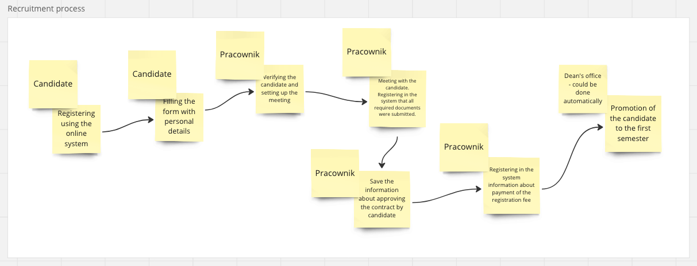
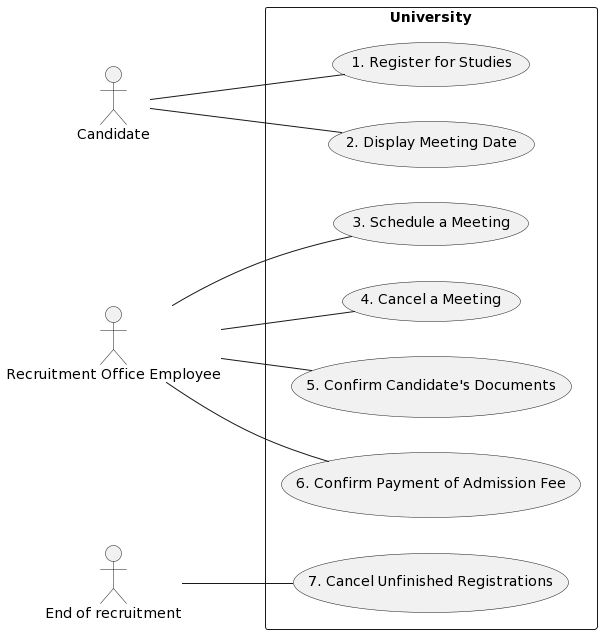

# blueprint-hub

# Short descrition
This repository stores examples of various implementations based on the same business requirements. The repository was created as an example of different ways to solve the same problem. 
None of the presented solutions is considered perfect. 
Each solution presents certain advantages and disadvantages. 
Whether a given architecture is appropriate for a specific problem always depends on the context of the decisions being made. I hope that this repository will help to show a broader picture of different kinds of approaches.

# Introduction to business requirements
Our repository will implement a certain set of business requirements. In the presented examples, we want to show both simpler and more complex use cases. For this reason, our business domain must possess a certain level of complexity. On the other hand, we obviously do not want the complexity of the presented domain to hinder the understanding of the examples. 
For this reason, we have chosen a domain that will probably be at least partially familiar to the reader - it will be the sphere of higher education institutions' functioning. Of course, for the purposes of our examples, we will simplify the real business processes a bit and focus only on a few of them. It will therefore be an excerpt of a somewhat simplified reality, which I hope will be enough to present both simpler and more complex implementation examples.

# Business requirements

## Context
Our application will handle some of the processes necessary for the operation of a higher education institution. 
We assume that our system is to be introduced at a private university. 
The mentioned university educates approximately 10,000 students annually. 
The university currently offers several different fields of study across several faculties. 

The operation of the university requires the cooperation of many different departments, including: 
- recruitment department - responsible for interviewing candidates for studies 
- dean's office - responsible for processes related to student services, educators, grades, current student affairs, and promotions for the new semester 
- accounting department - handling student payments and employee salaries 
- administration department - managing room service and equipment management 
- IT department - providing technical support for computers located in various classrooms
- and others 

This description outlines the institution we will be working with. We will not be handling all processes related to the operation of the university. 
We are to focus on managing processes related to the recruitment of candidates for studies and the promotion of students to the next semester.

## Business requirements
We decided to talk with the representatives of two departments at our university: the Recruitment Office and the Dean's Office.
The business requirements will be written down in the form of dialog between analyst and university employee.

### Recruitment Office
Analyst:
Could you briefly describe how the recruitment process is conducted?

Employee:
Sure, the recruitment process involves a few steps. The first step occurs when the potential candidate registers through the online system. After registration, we would like to set up an appointment at our university. The potential candidate must show up with additional documents which proves that you qualify to university-level education. We manually verify that all the necessary documents are correct. If everything is in order, they are given the contract to sign. The final step is to pay the admission fee. Usually, the student has around two weeks to make this payment. After that, they are enrolled and advanced to the first semester.

Analyst:
Let's delve deeper into the individual steps. In the first step, the candidate must register through the online system. Is this the only way for a candidate to start the process, or can they, for example, visit your office personally, and you register them?

Employee:
Not really, the student must do it on their own. Sometimes we have candidates with very special needs, but then we sit with them and show them how to register step by step.

Analyst:
What kind of data must the student provide?

Employee:
The candidate must provide their first name, last name, phone number, email address, home address, the study program they selected from our offerings, gender, PESEL number or passport number, nationality, and date of birth.

Analyst:
Are all these pieces of information required?

Employee:
Yes.

Analyst:
After submitting all this information, the candidate waits for the appointment time?

Employee:
Yes, we use a separate system for scheduling appointments, sending notifications, and so on. We receive the date from this system, and the candidate gets a notification.

Analyst:
Are candidates scheduled for a specific date and time, or can they be late?

Employee:
Candidates are scheduled for a specific date without an exact time. They can come during our open hours.

Analyst:
Can a candidate ask for the time to be changed, or maybe they didn't show up for some reason and ask for the meeting to be rescheduled? Are these scenarios possible?

Employee:
Yes, but we only allow it over the phone. If the candidate doesn't show up, we usually keep track of this information in the system and sometimes schedule an additional appointment.

Analyst:
Do you keep a history of meetings with the student in this external system, or do you maintain it yourself?

Employee:
We do it ourselves. The external system does not offer this option.

Analyst:
What happens during the meeting? What kind of additional documents must the students show?

Employee:
The candidate usually has to bring documents proving they they qualify to study at university. For example, if someone is applying for master's studies, they must bring their bachelor's degree certificate.

Analyst:
So, the documents they must bring depend on the study program they chose in the first step?

Employee:
Yes, but I should be more precise. Study programs are, for example, IT studies. We offer the same program at different levels (or cycles) - for instance, bachelor's, master's, etc. In the first step, the student must choose the study program, level of studies, and usually the mode of studies (full-time, part-time, etc.). Depending on this set of choices, the candidate may have to bring different documents.

Analyst:
I assume the candidate would see this list before the meeting.

Employee:
Yes, ideally, they would see the meeting date and all the necessary documents they must bring in the system. One more thing - of course, they have to bring their ID or passport.

Analyst:
I assume you check all these documents manually?

Employee:
Yes, we check them manually. We usually make a copy of them and record that the specific document was provided.

Analyst:
What happens if someone brought only some of the documents?

Employee:
Well, we record which documents were provided and schedule another meeting. Only after bringing all the documents can we proceed further.

Analyst:
Okay, what happens when you receive all the documents?

Employee:
We show the student the full contract. They have time to read it, and then they can sign it. We record their decision in the system. If they sign the contract, we bring all the information to the Dean's office, and they handle the enrollment process. Enrollment means creating the student account and adding the student to the list of students for the first semester.

Analyst:
I assume that the enrollment itself is handled by the Dean's office based on the documents you bring them?

Employee:
Yes, we only bring them all the information collected from the candidate.

Analyst:
Do you use any specific names for all these steps?

Employee:
I don't think we have any official names for all these steps. We sometimes use terms like "registration phase," "meeting phase," etc.

Analyst:
What happens if someone never shows up for the meeting?

Employee:
We just keep their information with an annotation that the candidate's proposal was canceled.

Analyst:
Is there a specific time when you assume that the candidate's proposal is canceled?

Employee:
Each semester, we have strict dates when the recruitment process is finished.

Analyst:
Who chooses these dates?

Employee:
They are usually set up by the Dean. Each semester, they may be different.

Analyst:
Could you elaborate a bit on what exactly a semester is?

Employee:
Well, a semester is usually something like "summer 2024" or "winter 2024." It's typically a year and a season - either summer or winter. We have two recruitment periods each year, and each recruitment phase has different start and end dates.

Analyst:
Thank you, I think I have some information to start with.

Employee:
Great, let me know if you need any additional information.

## Business analysis artifacts
Based on the requirements, we will need to develop several applications:

- A frontend application for the candidate.
- A frontend application for the Recruitment Office employee.
- A backend application to support the frontend applications.

In our current example, we will focus on the backend. For now, we will not delve into details regarding the discussion of architecture of the complete solution. Our concentration is on implementing the backend.

Based on the inverview our analyst created various artifacts.

### Process
Our analyst created a sketch of the process using some sticky cards.

### Use case diagram
Our analyst created a use case diagram of all the use cases

